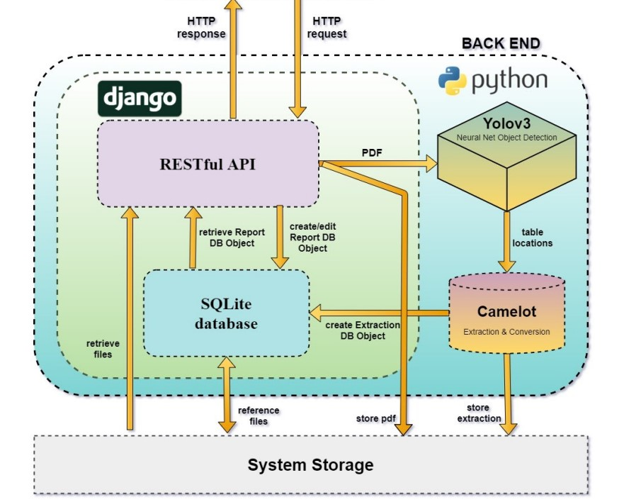

# Automated PDF Tabulated Data Extractor Engine and API

This project is a Python-based backend system designed to extract tabulated data from PDF documents automatically. It utilizes a combination of YOLO object detection and Camelot for parsing tables and provides results in easily consumable formats like CSV and JSON. The system exposes a REST API for seamless integration and automation.

For detailed full System Documentation, see [PDF-extraction-system-documentation.pdf](path/to/PDF-extraction-system-documentation.pdf).

## Features

- **Automated Table Detection**: YOLOv3 is used for identifying tables in PDF documents.
- **Data Extraction and Parsing**: Camelot is used for parsing detected tables into structured data.
- **REST API**: A Django-based REST API for handling uploads, extractions, and data retrieval.
- **Export Options**: Supports exporting extracted data as CSV and JSON.

## System Overview

The primary goal of this system is to reduce manual effort involved in extracting financial data from company reports and other structured documents. The system automates the detection and parsing of tables from large PDF documents, making the data easily accessible.

- **API-Driven**: The API is the central component that manages communication between the front-end and back-end, as well as with the database.
- **Modular Extraction Engine**: The extraction engine handles the core functionality of identifying and parsing tables within PDFs.
- **Customizable Configuration**: Easily adjust start and end pages for extraction, export formats, and more.



## Technology Stack

- **Python**: Core language for the system.
- **Django**: Backend framework that manages the API and storage.
- **YOLOv3**: Model used for object detection.
- **Camelot**: Library used for table parsing and data extraction.
- **SQLite**: Default database for storing report metadata.

## Back-End Architecture

The system is designed with a service-oriented architecture where the REST API acts as the gateway for all functionalities. The core extraction engine processes the uploaded PDFs, and results are stored in a SQLite database for future reference and retrieval.

### Key Responsibilities of the API:
- Manages all requests to and from the database.
- Sends PDFs to the extraction engine.
- Retrieves extracted data from system storage and returns it to the user.

By utilizing the API as the central gateway, the entire process is streamlined and automated.


### Extraction Engine Overview

The extraction engine is designed to process PDF documents with non-standard formatting by leveraging trained object detection models (YOLO). It locates table data within PDFs using image recognition and converts the detected tables into CSV format using the Python library Camelot.

#### Process Overview:
1. The engine reads a PDF page using PyPDF2 and obtains the page dimensions.
2. The PDF page is converted to an image using `pdf2img`, and the image dimensions are obtained using `matplotlib`.
3. The image is passed to the object detection system (YOLO) to identify table data. If detected, the system returns the table's location coordinates.
4. The coordinates are normalized for reference back to the original PDF document using both image and PDF page coordinates.
5. The PDF page and normalized coordinates are passed to the Camelot library for data extraction into a dataframe, allowing for data cleaning and conversion to CSV.

This approach offers a reliable solution for extracting table data from PDFs, even when dealing with complex document structures that lack a consistent semantic layout.


## Results / Examples


## Installation

### Prerequisites

- **Python 3.7 or higher**
- **Git**
- **Poppler**: Required for Camelot

### Setup

1. **Clone the Repository**:

    ```bash
    git clone https://github.com/famesjranko/automated-PDF-tabulated-data-extractor-api.git
    cd automated-PDF-tabulated-data-extractor-api
    ```

2. **Set Up a Virtual Environment**:

    ```bash
    python3 -m venv env
    source env/bin/activate  # For Unix
    env\Scripts\activate  # For Windows
    ```

3. **Install Dependencies**:

    ```bash
    pip install -r requirements.txt
    ```

4. **Install Poppler**:

    - **Ubuntu**: `sudo apt-get install poppler-utils`
    - **macOS**: `brew install poppler`
    - **Windows**: [Download Poppler for Windows](http://blog.alivate.com.au/poppler-windows/)

5. **Run Migrations**:

    ```bash
    python manage.py makemigrations
    python manage.py migrate
    ```

6. **Run the Development Server**:

    ```bash
    python manage.py runserver 0.0.0.0:8000
    ```

Access the admin portal at [http://127.0.0.1:8000/admin/](http://127.0.0.1:8000/admin/) using:

- **Username**: `admin`
- **Password**: `lensell`

## API Endpoints

- **Upload and Extract a Report**: `POST /api/upload/`
- **Retrieve All Reports**: `GET /api/reports/`
- **Retrieve Report by ID**: `GET /api/reports/{id}/`
- **Retrieve Report by Name**: `GET /api/reports/?name={name}`
- **Download Extraction Results**: `GET /api/reports/{id}/download/`

Refer to the API documentation for detailed request and response formats.

## System Components

### 1. **Extraction Engine**:

- The engine identifies tables using YOLOv3 and parses them using Camelot. This allows it to handle both bordered and non-bordered tables effectively.

### 2. **API Layer**:

- The API handles document uploads, extraction requests, and retrieval of previously processed reports.

### 3. **Storage**:

- The system stores both raw PDFs and extracted data in a structured manner using Django’s storage backend.

## Troubleshooting

### Common Issues

- **Database Errors**: If you encounter migration issues, run:

    ```bash
    python manage.py migrate --fake
    ```

- **Poppler Not Found**: Ensure Poppler is correctly installed and available in your system's PATH.

## Future Enhancements

1. **Docker Deployment**: Encapsulating the system in a Docker container for easy deployment.
2. **AWS Integration**: Storing extraction history across multiple instances using Amazon Web Services.
3. **Advanced YOLOv3 Training**: Improving table detection by distinguishing between different table types.
4. **Ensemble Object Detection**: Enhancing prediction accuracy using model voting strategies.

## Contributing

Contributions are welcome! Please fork this repository and submit pull requests.

## SCREENSHOTS
**UPLOAD**  
  

**UPLOAD DB-DATA-CONTROL**  
  

**ADMIN VIEW REPORTS**  
  

**ADMIN EDIT/ADD/DELETE REPORT**  
  

