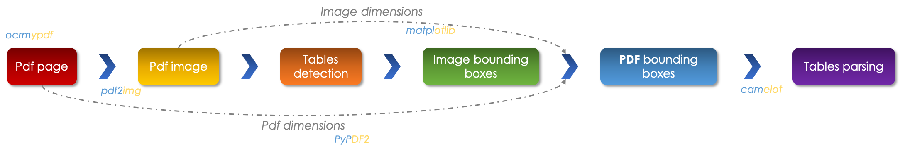
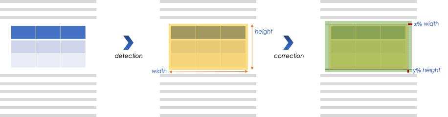
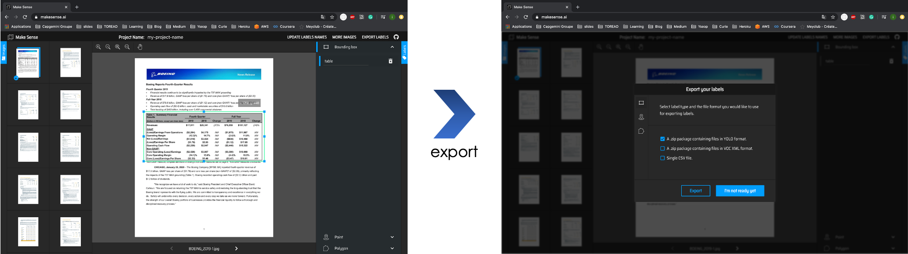
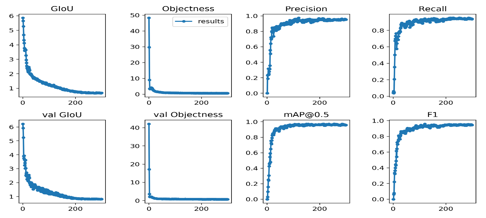
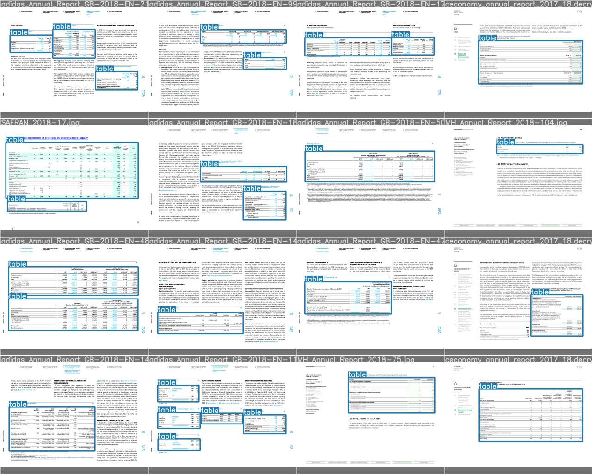

# YOLOV3-PDF-Parser

There exist many python librairies which enable the parsing of pdfs, `Camelot` is one of the best. Although it performs well on text, however, it struggles on tables specially the ones localized inside paragraphs. Camelot offers the option of specifying the regions to parse through the variable `table_areas="x1,y1,x2,y2"` where (x1, y1) is left-top and (x2, y2) right-bottom in PDF coordinate space. When filled out, the result is significantly enhanced. 

## Explaining the basic idea
One way to automize the parsing of tables is to train an algorithm capable of returning the coordinates of the bounding boxes circling the table, as detailled in the following pipeline:

<center></center>

If the primitive pdf page is image-based, we can use `ocrmypdf` to turn into a text-based one in order to be able to get the text inside of the table. We, then, carry out the following operations:
* Transform a pdf page into an image one using `pdf2img`
* Use a trained algorithm to detect the regions of tables. 
* Normalize the bounding boxes, using the *image dimension*, which enables use to get the regions in the pdf space using the *pdf dimensions* obtained through `PyPDF2`. 
* Feed the regions to `camelot` and get the corresponding pandas dataframes.

<br>When detecting a table in pdf image we expand the bounding boxe in order to guarante its full inclusion, as follows:


<center></center>

## Tables detection
The algorithm which allows the detection of tables, is nothing but yolov3, I advise your to read my previous [article](https://medium.com/swlh/object-detection-face-recognition-algorithms-146fec385205) about objects detection.
We finetune the algorithm to detect tables and retrain all the architecture.
To do so, we carry out the following steps:
* Create a training database using [`Makesense`](https://www.makesense.ai/) a tool which enables an export in yolo's format:

<center></center>

* Train a [`yolov3`](https://www.ismailmebsout.com/Convolutional%20Neural%20Network%20-%20Part%202/#yolov3-algorithm) [`repository`](https://github.com/ultralytics/yolov3) modified to fit our purpose on AWS EC2, we get the following results:

<center></center>
 
## Requirements
All python requirements are included in the file package.txt, all you need to do is run the following command line:

```bash
pip install -r packages.txt
```
To choose between in CPU and GPU mode utilising CUDA, in utils/detect_func.py set device='cpu' or '0' or '0,1,2,3'

* GPU mode requires CUDA capable hardware, and the installation of both CUDA drivers and pytorch.
[PyTorch installation guide](https://pytorch.org/get-started/locally/)

* Example, for windows 10, pytorch stable, using Python and pip, and CUDA v10.2:

```bash
pip install torch==1.9.0+cu102 torchvision==0.10.0+cu102 torchaudio===0.9.0 -f https://download.pytorch.org/whl/torch_stable.html
```
To verify CUDA and PyTorch installation run test script:

```bash
python cuda_test,py
```

## Prediction
To make a prediction, import module and call detection function:
```python
import predict_table
predict_table.detect_tables(pdf_path, page_number)
```
It takes two arguments:
* **pdf_path**: where the original pdf file is located
* **page**: the desired page to parse

To run predictions on a whole document:
```python
import predict_table
for page in range(1, n_pages, 1):
    predict_table.detect_tables(pdf_path, page)
```

## Examples

<center></center>

**NB**: following the same steps, we can train the algorithms to detect `any other object` in a pdf page such as graphics and images which can be extracted from the image page.
